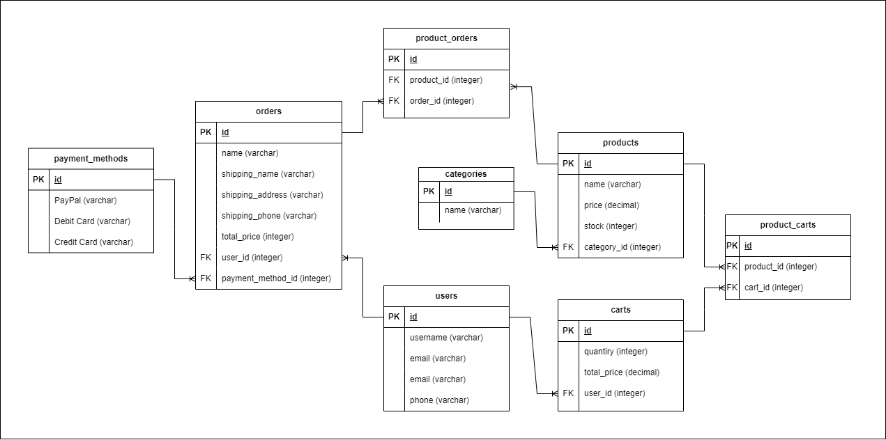

 ## Voucher Management System:

### Entity Relationship Diagram (ERD) for a Voucher Management System.

The use case for the system is as follows:

A user should be able to log in to the system and view a list of available vouchers sorted by category. The user can then add selected vouchers to their cart, which they can review before proceeding to checkout to place an order. The checkout process should include the following steps:

1. Review cart contents (voucher names, categories, quantities, prices)
2. Enter shipping information (name, address, contact information)
3. Choose a payment method (credit/debit card, PayPal, etc.)
4. Review and confirm order

